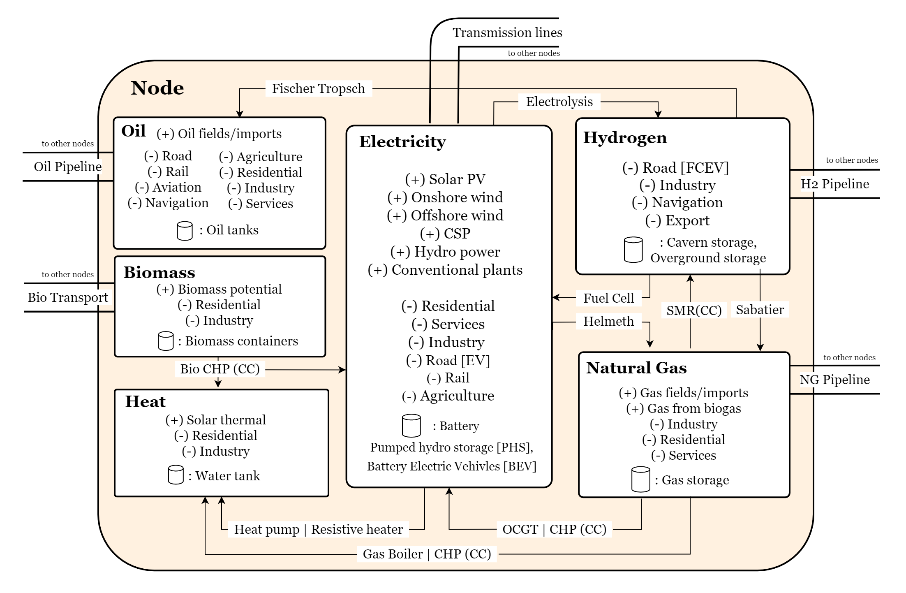

# Sector-coupled PyPSA-Earth: A Global Open Source Multi-Energy System Model


## Development Status: Version 0.1

[](https://github.com/pypsa-meets-earth/pypsa-earth-sec/actions/workflows/ci-linux.yaml)
[](https://github.com/pypsa-meets-earth/pypsa-earth-sec/actions/workflows/ci-mac.yaml)
[](https://github.com/pypsa-meets-earth/pypsa-earth-sec/actions/workflows/ci-windows.yaml)
[](https://pypsa-meets-earth.readthedocs.io/en/latest/?badge=latest)

[](https://www.gnu.org/licenses/gpl-3.0)
[](https://github.com/psf/black)
[](https://results.pre-commit.ci/latest/github/pypsa-meets-earth/pypsa-earth-sec/main)
[](https://discord.gg/VHH8TCwn)
[](https://drive.google.com/drive/folders/1U7fgktbxlaGzWxT2C0-Xv-_ffWCxAKZz)

Sector-coupled PyPSA-Earth is the first of its kind: an open-source, sector-coupled energy system model with global coverage. It is designed to facilitate transparent analysis and informed decision-making for a sustainable energy future.
The model's workflow leverages open datasets to customize the model according to the specific needs of any country or region, delivering complete optimization results that encompass policy, technical, economic, and environmental impacts.
It is built on top of [PyPSA-Earth](https://github.com/pypsa-meets-earth/pypsa-earth), the two models are soon to be merged into one encompassing the scope of both models.

Our mission with Sector-coupled PyPSA-Earth is to empower stakeholders around the globe with the ability to transparently analyze and plan the transition to a decarbonized, integrated energy system.
By making this tool openly available, we aim to foster collaboration, innovation, and informed policy-making that leads to sustainable and efficient energy solutions for the future.

The paper describing the model in details is currently under review. The preprint is already available [here](https://papers.ssrn.com/sol3/papers.cfm?abstract_id=4743242).

## Key Features

Sector-coupled PyPSA-Earth model introduces several novel features that set it apart:

1. **Global Coverage:** It is the first open-source model capable of simulating sector-coupled energy systems on a global scale.
2. **Adaptable Demand Projection Tool:** The model includes a flexible tool for projecting energy demand, tailored to the specifics of the region or country under study.
3. **Global Geo-Asset Dataset:** A comprehensive dataset compiled from open sources forms the backbone of the model, providing detailed insights into energy assets worldwide.
4. **Custom Dataset Integration:** While the model extensively uses open datasets, it also allows for the easy integration of custom datasets, offering flexibility to users who have specific data at their disposal.

The diagram below depicts one representative clustered node showing the combination of carriers and sectors covered in the model as well as the generation and conversion technologies included.




## Installation

1. Open your terminal at a location where you want to install pypsa-earth-sec. Type the following in your terminal to download the package and the dependency (pypsa-earth) from GitHub.
   Note that the tag `--recursive-submodules` is needed to automatically clone also the pypsa-earth dependency.

   ```bash
       .../some/path/without/spaces % git clone --recurse-submodules https://github.com/pypsa-meets-earth/pypsa-earth-sec.git
   ```
   To make sure you run the latest version of the submodule (if desired), run the following command to update the git submodules:
   ```bash
       .../some/path/without/spaces % git submodule update
   ```

2. Move the current directory to the head of the repository.
   ```bash
       .../some/path/without/spaces % cd pypsa-earth-sec
   ```

3. (optional) For reproducibility and compatibility purposes, it is possible to specify a specific version of the pypsa-earth submodule.
   To do so, feel to reproduce the following lines, yet this is not mandatory.
   If you desire to run the latest pypsa-earth model, please skip this point 3.

   ```bash
       .../pypsa-earth-sec % cd pypsa-earth
       .../pypsa-earth % git reset --hard \{commit id\}
       .../pypsa-earth % cd ..
   ```

4. The python package requirements are curated in the `envs/environment.yaml` file of the pypsa-earth repository.
   The environment can be installed using:

   ```bash
       .../pypsa-earth-sec % conda env create -f pypsa-earth/envs/environment.yaml
   ```

5. For running the optimization one has to install the solver. We can recommend the open source HiGHs solver which installation manual is given [here](https://github.com/PyPSA/PyPSA/blob/633669d3f940ea256fb0a2313c7a499cbe0122a5/pypsa/linopt.py#L608-L632).

6. To use jupyter lab (new jupyter notebooks) **continue** with the [ipython kernel installation](http://echrislynch.com/2019/02/01/adding-an-environment-to-jupyter-notebooks/) and test if your jupyter lab works:

   ```bash
       .../pypsa-earth % ipython kernel install --user --name=pypsa-earth
       .../pypsa-earth % jupyter lab
   ```

## Test run

- In the folder *pypsa-earth-sec* open a terminal/command window to be located at this path `./pypsa-earth-sec/`
- Rename config.default.yaml to config.yaml. For instance in Linux:
`mv config.default.yaml config.yaml`
- Open the file `config.yaml` and follow the steps done before in pypsa-earth
  - choose the country you want to model. For example
    `countries: ["MA"]`

- Run a dryrun of the Snakemake workflow by typing simply in the terminal:
  ```bash
  snakemake -j 1 solve_all_networks -n
  ```
  Remove the -n to do a real run. Follow the tutorial of PyPSA-Eur 1 and 2 on [YouTube](https://www.youtube.com/watch?v=ty47YU1_eeQ) to continue with an analysis.

## Licenses

Energy Statistics from UNSD ([Terms of use](https://unstats.un.org/unsd/energystats/data/)):
All data and metadata provided by UNSD may be copied freely, duplicated and further distributed provided that UNSD is cited as the reference and the use is not for profit. Otherwise please contact UNSD. 

Global Steel Plant from GlobalEnergyMonitor ([License](https://globalenergymonitor.org/projects/global-steel-plant-tracker/download-data/)):
All Global Energy Monitor data are freely available under the Creative Commons Attribution Public License below, unless otherwise noted. 

Global database of cement production ([Terms of use](https://www.cgfi.ac.uk/spatial-finance-initiative/geoasset-project/cement/)):
The dataset is distributed under the licence Creative Commons Attribution 4.0 International (CC BY 4.0).

Petrochemicals Database For Europe And North America ([Terms of use](https://www.cgfi.ac.uk/spatial-finance-initiative/geoasset-project/petrochemicals/)):
The Spatial Finance Initiative Petrochemicals Database for Europe and North America can be used by others and is available under a CC BY 4.0 license.

Global Oil Refinery Complex, Daily Capacity, CO2 Emissions and Various Ancillary Products Statistics from Esri-ArcGIS ([License and Terms of use](https://www.esri.com/en-us/legal/copyright-proprietary-rights)):
Esri grants the recipient of the Esri information contained within the esri.com Web site the right to freely reproduce, redistribute, rebroadcast, and/or retransmit this information for personal, noncommercial purposes, including teaching, classroom use, scholarship, and/or research, subject to the fair use rights enumerated in sections 107 and 108 of the Copyright Act (Title 17 of the United States Code). All copies, whether in whole or in part, shall include the appropriate Esri copyright notice.

Global  Coal and Metal Mine Production Statistics ([License](https://www.nature.com/articles/s41597-023-01965-y)):
The dataset is distributed under the licence Creative Commons Attribution 4.0 International (CC BY 4.0)

Pulp And Paper Mill Database For Latin America ([Terms of use](https://www.cgfi.ac.uk/spatial-finance-initiative/geoasset-project/pulp-and-paper-mill-database-for-latin-america/)):
The Spatial Finance Initiative Pulp and Paper Mill Database for Latin America can be used by others and is available under a CC BY 4.0 license.

OurAirport Global Airport Statistics ([Terms of use](https://ourairports.com/data/)):
All data is released to the Public Domain, and comes with no guarantee of accuracy or fitness for use.

World Port index Statistics from National Geospatial-Intelligence Agency (NGA) ([Terms of use](https://www.nga.mil/resources/Privacy_Policy.html)):
This website is provided as a public service by NGA’s Office of Corporate Communications. Information presented on this website is considered public information and may be distributed or copied unless otherwise specified.

