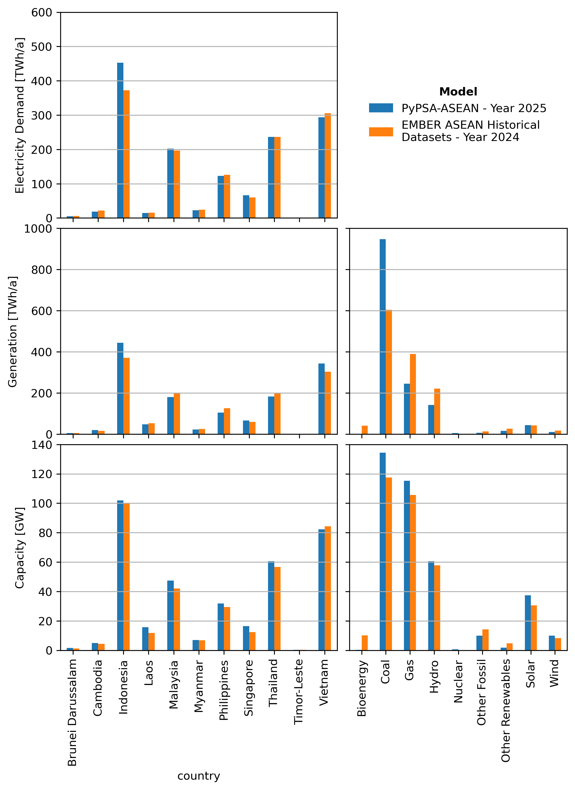

# Analysis

This chapter documents the analysis resources, notebooks, and downloadable scenario results used for reproducing the PyPSA-ASEAN figures and tables.

- [Download Scenarios](download-scenarios.md)
- [Jupyter Notebooks](jupyter-notebooks.md)

## Validation

> Full results are currently under review

We evaluate the validity of the PyPSA-ASEAN model by benchmarking it against historical regional energy data. The Ember Yearly Electricity Data (2025) [^30] serves as the reference for electricity demand, installed capacity, and generation, which are summarized in Figure 3. Regarding the recency of the dataset, data is available up to the year 2024 for the majority of the region. However, data for Brunei Darussalam, Laos, and Timor-Leste is limited to the year 2023.

As outlined in the methodology, demand inputs are set exogenously based on the 2025 AEO8 Baseline. While the region shows a consistent average demand difference of 5% relative to Ember historical data, Indonesia presents a significant outlier with a 21.5% variance. This discrepancy is attributed to differences in the base assumptions of the external AEO8 dataset rather than the model optimization.

While the model initializes installed capacity using powerplantmatching, the model also allows for endogenous capacity expansion for bioenergy, gas, solar, and wind. The optimized capacity indicates excessive coal and gas capacity while omitting biomass capacity compared to Ember datasets. These data inconsistencies collectively contribute to regional average capacity variance of 6% higher than historical benchmark. 

The electricity generation results are fundamentally driven by the principle of lowest-cost optimization. While overall generation exhibits an average difference of 4.4%, significant variances exist at the source level. Specifically, coal generation is 56.9% higher, whereas gas and hydro generation are 36.9% and 35.8% lower, respectively, compared to historical benchmarks. These generation discrepancies may be attributed to unknown dispatch strategies employed across various countries that are not captured by the model. 

While it is a valid assumption that national dispatch is governed by economic principles, relying on static or fixed fuel costs may result in generation patterns that diverge from historical observations. Since developing localized dispatch logic and precise fossil fuel price forecasts falls outside the defined scope of this study, these uncertainties are acknowledged. The current configuration is therefore established as the baseline model for all subsequent scenarios.

---
### References

[^30]: Yearly Electricity Data. Ember https://ember-energy.org/data/yearly-electricity-data/

