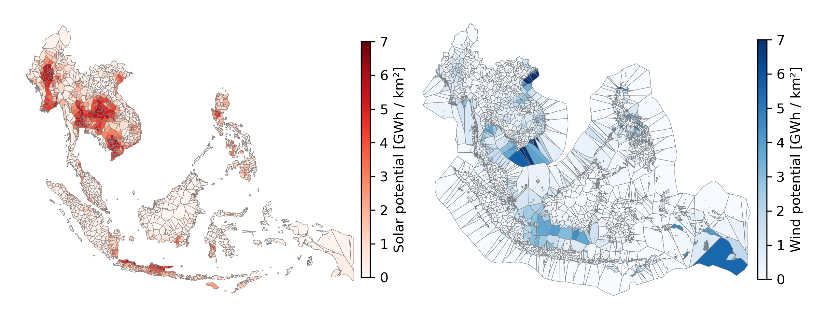

# Configuration

This chapter compares the default PyPSA-Earth configuration to the PyPSA-ASEAN configuration. 

- [Project Configuration](project-config.md)
- [Scenarios Configuration](scenarios-config.md)

## Methodology

> All citations are provided in academic publications referenced in the [Index](../index.md)

PyPSA-ASEAN is a regional adaptation of the open-source PyPSA-Earth framework [15]. It builds on PyPSA-Earth’s preprocessing routines and optimisation capabilities, while leveraging ASEAN-specific data on power plants, renewable resources, transmission infrastructure, and electricity demand. Inclusion of customized data, on top of the PyPSA-Earth compatible databases, allowed the model to represent the region’s electricity system and enable the optimization of least-cost investment and dispatch of generation, storage, and transmission assets.

In this work, input data was compiled from multiple open-source databases to ensure high resolution and consistency.

- Renewable generation potentials were estimated using Atlite, which processes Copernicus ERA5 climate data to generate hourly time series for onshore and offshore wind, solar PV, and hydropower [16], as shown in the Figure above. 
- Rooftop solar PV potential was estimated using Obane’s methodology [17], which combines GIS-derived rooftop areas with installation ratios from related literature. 
- Power plant data were gathered using the powerplantmatching Python package [18], which consolidated and cross-validated datasets, primarily from Global Energy Monitor.
- Renewable energy infrastructure from IRENA [19] were incorporated and allocated according to regional resource potential. Transmission network data are derived from OpenStreetMap [20] and national power development plans [21-28], including all 2025 infrastructure (planned or under construction) to ensure internal connectivity within each country, with the exception of Indonesia’s Supergrid, as visualised in Figure 2. 
- Technology cost assumptions combine PyPSA-Earth’s default database and data from AEO8 [5]. 
- Electricity demand growth followed the AEO8’s Baseline Scenario [5] with demand projections disaggregated two-fold: first, by country based on UN population projections [29], and second, nodally within countries based on historical rasterized population and GDP data (adapted from PyPSA-Earth [15]).

System expansion was simulated from 2025 to 2050 at five-year intervals. With this, investment decisions were determined sequentially using a myopic approach, in which capacity expansion in each period was optimised based on prevailing system conditions without knowledge of future periods. This approach reflected practical planning constraints and captured stage-wise development of generation, storage, and transmission assets.