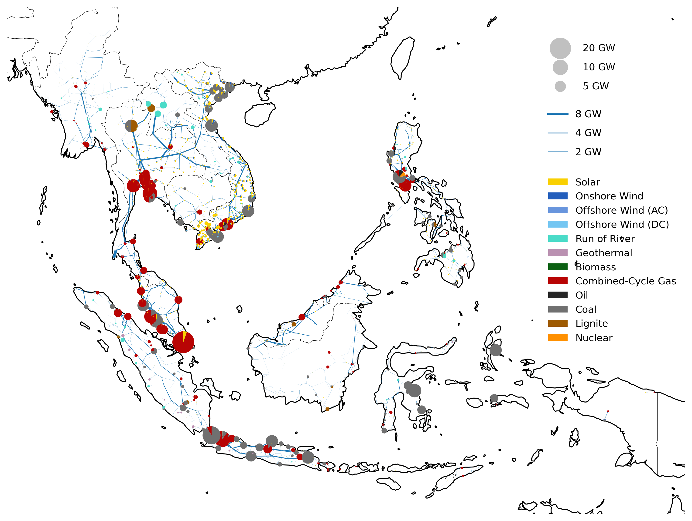

# PyPSA-ASEAN

**PyPSA-ASEAN: An ASEAN-Focused Sector-Coupled Open-Source Multi-Energy System Model**

PyPSA-ASEAN is the first open-source ASEAN-wide cross-sectoral energy system model with high spatial and temporal resolution. It builds on the existing PyPSA-Earth framework and integrates region-specific data tailored to the context of the Southeast Asia region. It aims to leverage the ongoing improvements in PyPSA-Earth using the soft-fork strategy while making it as easy as possible for users to create validated models of individual ASEAN countries or the entire region at once.

The following countries are available to use in this model:

* 🇧🇳 **Brunei**
* 🇰🇭 **Cambodia**
* 🇮🇩 **Indonesia**
* 🇱🇦 **Laos**
* 🇲🇾 **Malaysia**
* 🇲🇲 **Myanmar**
* 🇵🇭 **Philippines**
* 🇸🇬 **Singapore**
* 🇹🇭 **Thailand**
* 🇹🇱 **Timor-Leste**
* 🇻🇳 **Vietnam**

For further readings of PyPSA and PyPSA-Eur, check out:

* [PyPSA](https://docs.pypsa.org/latest/)
* [PyPSA-Earth](https://pypsa-earth.readthedocs.io/en/latest/)

Details on the model are available in the following academic publications:

1. PyPSA-ASEAN: A High-Resolution, Open-Source Model for Planning Southeast Asia’s Energy Future **(Under review)**

The PyPSA scenario results and sensitivity can be downloaded here:

1. [results-asean-paper-v1.zip](https://drive.google.com/file/d/194my_d3eotQ1GvsGGN5KOZGWOHEivoQy/view?usp=drive_link)

# Chapters

These are the chapters in the documentation:

- [Introduction](Introduction/index.md)
- [Feature](Feature/index.md)
- [Configuration](Configuration/index.md)