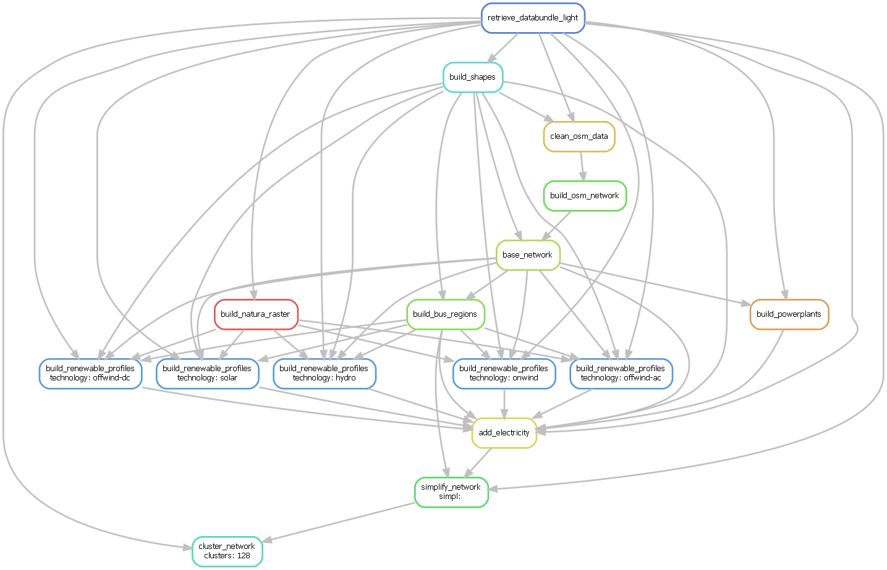

# Introduction

A short video explaining the logic of PyPSA-Eur which is similar to PyPSA-Earth:

<div style="position: relative; padding-bottom: 56.25%; height: 0; overflow: hidden; max-width: 100%; height: auto;">
    <iframe style="position: absolute; top: 0; left: 0; width: 100%; height: 100%;" src="https://www.youtube.com/embed/ty47YU1_eeQ" frameborder="0" allow="accelerometer; autoplay; encrypted-media; gyroscope; picture-in-picture" allowfullscreen></iframe>
</div>

For more details on PyPSA-Earth read the below milestone paper. For citations, please use the following BibTeX:

```bibtex
@misc{PyPSAEarth,
  author = {Parzen, Maximilian and Abdel-Khalek, Hazem and Fedorova, Ekaterina and Mahmood, Matin and Frysztacki, Martha Maria and Hampp, Johannes and Franken, Lukas and Schumm, Leon and Neumann, Fabian and Poli, Davide and Kiprakis, Aristides and Fioriti, Davide},
  title = {PyPSA-Earth. A new global open energy system optimization model demonstrated in Africa},
  publisher = {Applied Energy},
  year = {2023},
  url = {https://www.sciencedirect.com/science/article/pii/S030626192300460},
  doi = {https://doi.org/10.1016/j.apenergy.2023.121096},
}
```

## Workflow

The generation of the model is controlled by the workflow management system [Snakemake](https://snakemake.bitbucket.io/). In a nutshell, the `Snakefile` declares for each python script in the `scripts` directory a rule which describes which files the scripts consume and produce (their corresponding input and output files). The `snakemake` tool then runs the scripts in the correct order according to the rules' input/output dependencies. Moreover, it is able to track what parts of the workflow have to be regenerated when a data file or a script is modified/updated. For example, by executing the following snakemake routine:

```bash
.../pypsa-earth % snakemake -j 1 networks/elec_s_128.nc
```

the following workflow is automatically executed.



The **blocks** represent the individual rules which are required to create the file `networks/elec_s_128.nc`. Each rule requires scripts (e.g. Python) to convert inputs to outputs. The **arrows** indicate the outputs from preceding rules which a particular rule takes as input data.

!!! note "Reproducibility"
    For reproducibility purposes, the image can be obtained through:
    ```bash
    snakemake --dag networks/elec_s_128.nc | dot -Tpng -o workflow.png
    ```
    using [Graphviz](https://graphviz.org/)

## Folder structure

The content in this package is organized in folders as described below; for more details, please see the documentation.

- **`data`**: Includes input data that is not produced by any `snakemake` rule.
- **`scripts`**: Includes all the Python scripts executed by the `snakemake` rules.
- **`resources`**: Stores intermediate results of the workflow which can be picked up again by subsequent rules.
- **`networks`**: Stores intermediate, unsolved stages of the PyPSA network that describes the energy system model.
- **`results`**: Stores the solved PyPSA network data, summary files and plots.
- **`benchmarks`**: Stores `snakemake` benchmarks.
- **`logs`**: Stores log files about solving, including the solver output, console output and the output of a memory logger.
- **`envs`**: Stores the conda environment files to successfully run the workflow.

## License

PyPSA-Earth work is released under multiple licenses:

- All original source code is licensed as free software under [AGPL-3.0 License](https://github.com/pypsa-meets-earth/pypsa-earth/blob/main/LICENSES).
- The documentation is licensed under [CC-BY-4.0](https://creativecommons.org/licenses/by/4.0/).
- Configuration files are mostly licensed under [CC0-1.0](https://creativecommons.org/publicdomain/zero/1.0/).
- Data files are licensed under different licenses as noted below.

Individual files contain license information in the header or in the [dep5](.reuse/dep5). Additional licenses and urls of the data used in PyPSA-Earth:

{{ read_csv('configtables/licenses.csv') }}

**Legend:**

- *BY: Attribute Source*
- *NC: Non-Commercial Use Only*
- *SA: Share Alike*
