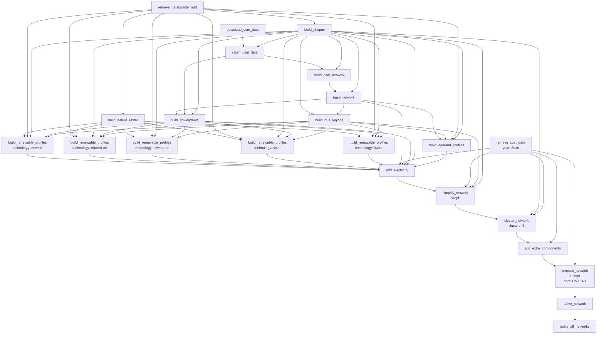

# Tutorial: Building and Running the Electricity Model

!!! note
    This tutorial assumes that you have already installed PyPSA-Earth and have a working environment. If you have not yet installed PyPSA-Earth, please refer to the [installation](../home/installation.md) section.

To properly model any region of the Earth, it is first crucial to get familiar with a tutorial
where a simpler model is considered. This section explains how to run and analyze the tutorial model.

## Build the tutorial electricity-only model

The user can explore the majority of the model's functions on a local machine by running the tutorial, which uses fewer computational resources than the entire model does. A tutorial data kit was developed to facilitate exploring the model.
You can build it using the tutorial configuration file `config.tutorial.yaml` (placed in the project folder `pypsa-earth`). It includes parts deviating from the default config file `config.default.yaml`, which are necessary to run the tutorial model. By default, PyPSA-Earth reads configuration parameters of simulation from `config.yaml` file located in `pypsa-earth` folder. Thus, to run the tutorial model, `config.tutorial.yaml` needs to be stored as `config.yaml`:


## How to configure runs for the tutorial model

The model can be adapted to include any selected country. But this tutorial is limited to `Nigeria ("NG")`,
`Benin ("BJ")`, `Botswana ("BW")` and `Morocco ("MA")`.

```yaml
countries: ["NG", "BJ"]
```

It's recommended to set `retrieve_databundle: true` when building the model for the first time to download all needed common data files.
When the first run is completed and all the necessary data are extracted, it may be a good idea to set `retrieve_databundle: false` to avoid data loss.

```yaml
enable:
retrieve_databundle: true  #  Recommended 'true', for the first run. Otherwise data might be missing.
```

The scenario is defined by the number of clusters and the optimization options. The tutorial model
is set to have 6 clusters and the optimization option "Co2L-4H" which translates absolute carbon-dioxide
emission limit with the model resampled to 4H resolution.

```yaml
scenario:
clusters: [6]
opts: [Co2L-4H]
```

The temporal scope is set to a single week. This is to make sure that the model completes in no time.

```yaml
snapshots:
start: "2013-03-1"
end: "2013-03-7"
```

!!! note
    For more information on the configuration file, please refer to the [config](../user-guide/configuration.md) section.

## Run the model

After configuration set-up, the model is ready to be built and run.
Open a terminal, go into the PyPSA-Earth directory, and activate the pypsa-earth environment with

```bash
conda activate pypsa-earth
```

You then need to copy the tutorial config file to `config.yaml`

```bash
cp config.tutorial.yaml config.yaml
```

!!! tip "Pro Tip"
    If you previously have a `config.yaml file`, You may want to reserve a copy of
    your current configuration file (`config.yaml`) as it will be overwritten by a tutorial configuration.

Before running the workflow you may check how it will look by using `--dryrun` or `-n` Snakemake option:

```bash
snakemake -j 1 solve_all_networks --dryrun
```

This triggers a workflow of multiple preceding jobs that depend on each rule's inputs and outputs:



In the terminal, this will show up as a list of jobs to be run:

```console
Building DAG of jobs...
Job stats:
job  count
-------------------------  -------
add_electricity  1
add_extra_components 1
base_network 1
build_bus_regions1
build_demand_profiles1
build_natura_raster  1
build_osm_network1
build_powerplants1
build_renewable_profiles 5
build_shapes 1
clean_osm_data   1
cluster_network  1
download_osm_data1
prepare_network  1
retrieve_cost_data   1
retrieve_databundle_light1
simplify_network 1
solve_all_networks   1
solve_network1
total   23
```


To run the whole model workflow you just need the following command:

```bash
snakemake -j 1 solve_all_networks
```

You can also run the tutorial model using the tutorial config directly by using the following command:

```bash
snakemake -j 1 solve_all_networks --configfile config.tutorial.yaml
```

This command will trigger loading of the whole dataset needed to build the model for a tutorial case if
both `tutorial` and `retrieve_databundle` flags are on. The tutorial model will run simulation of power systems in Nigeria and Benin.
Note that data load will need about 1.6GB and model building will take a while (about 20-50 minutes).

!!! tip "Pro Tip"
    It is good practice to perform a dry-run using the option -n, before you commit to a run:

    ```bash
    snakemake solve_all_networks -n
    ```

    Additionally, if you encounter issues with the rule `retrieve_databundle_light`, you can use the following script to debug it through the command line interface (CLI):

    ```bash
    python scripts/non_workflow/databundle_cli.py
    ```


## Analyse the solved networks

The solved networks can be analysed just like any other PyPSA network (e.g. in Jupyter Notebooks).

```python
import pypsa

network = pypsa.Network("results/networks/elec_s_6_ec_lcopt_Co2L-4H.nc")
```

The video below shows how to analyse solved PyPSA-Eur networks in Jupyter Notebooks.
Fabian Neumann did a great job explaining the basics of PyPSA and how to use it for analysis.

<iframe width="832" height="468" src="https://www.youtube.com/embed/mAwhQnNRIvs" frameborder="0" allow="accelerometer; autoplay; encrypted-media; gyroscope; picture-in-picture" allowfullscreen></iframe>

We also prepared an example notebook such that you can explore the tutorial network yourself.
Just open in our [notebooks repository](https://github.com/pypsa-meets-earth/documentation/tree/main/notebooks)
the file [sample-network-analysis.ipynb](https://github.com/pypsa-meets-earth/documentation/blob/main/notebooks/sample_network_analysis.ipynb). For further inspiration on what you can analyse and do with PyPSA,
you can explore the [examples section in the PyPSA framework documentation](https://docs.pypsa.org/latest/examples/examples/).

After playing with the tutorial model and before playing with different functions,
it's important to clean-up data in your model folder before to proceed further to avoid data conflicts.
You may use the `clean` rule for making so:

```bash
snakemake -j 1 clean
```

Generally, it's a good idea to repeat the cleaning procedure every time when the underlying data are changed to avoid conflicts between run settings corresponding to different scenarios.

It is also possible to make manual clean-up removing folders `resources`, `networks` and `results`. Those folders store the intermediate output of the workflow and if you don't need them anymore it is safe to delete them.

!!! tip "Pro Tip"
    This tutorial only covers Nigeria and Benin. To make the workflow run on other regions you need to use the `config.default.yaml` as `config.yaml``.
    To use the model in and outside Africa, you should also read [How to create a model for you region of interest with PyPSA-Earth?](https://github.com/pypsa-meets-earth/pypsa-earth/discussions/505)

[Model Customization](../user-guide/model-customization.md) section elaborates on building and running a full PyPSA-Earth model.
