# Tutorial: Building and Running the Sector-Coupled Model

!!! note
    If you have not yet installed PyPSA-Earth, please refer to the [installation](../home/installation.md) section.

In this tutorial, we will show you how to run the sector-coupled model. The sector-coupled model is a model that considers the energy system as a whole, including the electricity, heat, transport, and industry sectors. The model has been insipred and partially based on the PyPSA-Eur model, which is a model of the European energy system. The sector-coupled model is a global model that can be used to model any region of the Earth. This section explains how to run and analyze the tutorial model.

The sector-coupling code can be run as an overnight/greenfield scenario or myopic scenario.
The overnight scenario is a long-term scenario that runs for a year, while the myopic scenario
is a short-term scenario that runs for a day.


## Overnight Scenarios

### Configuration

All the configuration for a sector-coupled run are present in the `config.default.yaml` file.
In particular, the default value for foresight parameter is set to `overnight`. For the purpose
of this tutorial, `test/config.sector.yaml` will be used in addition to `config.default.yaml`
to run the sector-coupled model. That allows to enable using a lightweight tutorial datakit
enabled with tutorial: true.

```yaml
foresight: overnight
```

Documentation for all options is currently being updated in [config](../user-guide/configuration.md).

Scenarios can be defined like for electricity-only studies, but with additional wildcard options.


It is important to set the following flags `retrieve_databundle` and `retrieve_databundle_sector` to `false` after the first run to prevent unnecessary re-downloads, as the files only need to be downloaded once.

```yaml
enable:
  retrieve_databundle: true
  retrieve_databundle_sector: true
```

```yaml
scenario:
  simpl: [""]
  ll: ["copt"]
  clusters: [10]
  opts: [Co2L-3h]
  planning_horizons: # investment years for myopic and perfect; or costs year for overnight
  - 2030
  sopts:
  - "144h"
  demand:
  - "AB"
```

!!! note
	For allowed wildcard values, refer to [wildcards](../user-guide/wildcards.md).

### Execution
To run the tutorial for the sector-coupled model, you need to activate the pypsa-earth environment.
You need to have installed PyPSA-Earth using the instructions provided in the [installation](../home/installation.md) section.
Make sure to be in the PyPSA-Earth root directory and run the following command:

!!! tip
	It is good practice to perform a dry-run using the option -n, before you commit to a run:

	```bash
	snakemake solve_sector_networks -j2 --configfile test/config.sector.yaml -n
	```


```bash
conda activate pypsa-earth
snakemake solve_sector_networks -j2 --configfile test/config.sector.yaml
```

This covers the retrieval of additional raw data from online resources and preprocessing data about the transport, industry, and heating sectors as well as additional rules about geological storage and sequestration potentials, gas infrastructure, and biomass potentials. The workflow extracts all the data needed to run a model for any country of the world.

This triggers a workflow of multiple preceding jobs that depend on each rule's inputs and outputs:

```mermaid
graph TD
    solve_sector_networks["solve_sector_networks"]
    solve_sector_network["solve_sector_network"]
    add_export["add_export"]
    prepare_ports["prepare_ports"]
    retrieve_cost_data["retrieve_cost_data<br/>year: 2030"]
    build_ship_profile["build_ship_profile<br/>h2export: 10"]
    prepare_sector_network["prepare_sector_network"]
    override_respot["override_respot<br/>discountrate: 0.071<br/>sopts: 144h"]
    prepare_network["prepare_network<br/>ll: copt<br/>opts: Co2L-4H"]
    add_extra_components["add_extra_components"]
    cluster_network["cluster_network<br/>clusters: 6"]
    simplify_network["simplify_network<br/>simpl: "]
    add_electricity["add_electricity"]
    build_renewable_onwind["build_renewable_profiles<br/>technology: onwind"]
    build_natura_raster["build_natura_raster"]
    retrieve_databundle_light["retrieve_databundle_light"]
    build_shapes["build_shapes"]
    build_powerplants["build_powerplants"]
    base_network["base_network"]
    build_osm_network["build_osm_network"]
    clean_osm_data["clean_osm_data"]
    download_osm_data["download_osm_data"]
    build_bus_regions["build_bus_regions"]
    build_renewable_offwind_ac["build_renewable_profiles<br/>technology: offwind-ac"]
    build_renewable_offwind_dc["build_renewable_profiles<br/>technology: offwind-dc"]
    build_renewable_solar["build_renewable_profiles<br/>technology: solar"]
    build_renewable_hydro["build_renewable_profiles<br/>technology: hydro"]
    build_demand_profiles["build_demand_profiles"]
    prepare_energy_totals["prepare_energy_totals<br/>demand: AB<br/>planning_horizons: 2030"]
    build_base_energy_totals["build_base_energy_totals"]
    prepare_heat_data["prepare_heat_data"]
    build_clustered_population["build_clustered_population_layouts"]
    build_population_layouts["build_population_layouts<br/>planning_horizons: 2030"]
    prepare_urban_percent["prepare_urban_percent"]
    build_temperature_profiles["build_temperature_profiles"]
    build_cop_profiles["build_cop_profiles"]
    build_solar_thermal["build_solar_thermal_profiles"]
    build_heat_demand["build_heat_demand"]
    prepare_transport_data["prepare_transport_data"]
    prepare_transport_input["prepare_transport_data_input"]
    build_industry_demand["build_industry_demand"]
    build_industrial_key["build_industrial_distribution_key"]
    build_industrial_database["build_industrial_database"]
    build_base_industry["build_base_industry_totals<br/>demand: AB<br/>planning_horizons: 2030"]
    prepare_airports["prepare_airports"]
    prepare_gas_network["prepare_gas_network"]
    copy_config["copy_config"]
    
    solve_sector_network --> solve_sector_networks
    add_export --> solve_sector_network
    retrieve_cost_data --> solve_sector_network
    copy_config --> solve_sector_network
    prepare_ports --> add_export
    retrieve_cost_data --> add_export
    build_ship_profile --> add_export
    prepare_sector_network --> add_export
    cluster_network --> add_export
    override_respot --> prepare_sector_network
    retrieve_cost_data --> prepare_sector_network
    prepare_heat_data --> prepare_sector_network
    prepare_transport_data --> prepare_sector_network
    build_clustered_population --> prepare_sector_network
    build_industry_demand --> prepare_sector_network
    prepare_energy_totals --> prepare_sector_network
    prepare_airports --> prepare_sector_network
    prepare_ports --> prepare_sector_network
    cluster_network --> prepare_sector_network
    prepare_gas_network --> prepare_sector_network
    prepare_network --> override_respot
    prepare_energy_totals --> override_respot
    add_extra_components --> prepare_network
    retrieve_cost_data --> prepare_network
    cluster_network --> add_extra_components
    retrieve_cost_data --> add_extra_components
    simplify_network --> cluster_network
    build_shapes --> cluster_network
    retrieve_cost_data --> cluster_network
    add_electricity --> simplify_network
    retrieve_cost_data --> simplify_network
    build_bus_regions --> simplify_network
    build_shapes --> simplify_network
    build_renewable_onwind --> add_electricity
    build_renewable_offwind_ac --> add_electricity
    build_renewable_offwind_dc --> add_electricity
    build_renewable_solar --> add_electricity
    build_renewable_hydro --> add_electricity
    base_network --> add_electricity
    retrieve_cost_data --> add_electricity
    build_powerplants --> add_electricity
    build_shapes --> add_electricity
    build_demand_profiles --> add_electricity
    build_natura_raster --> build_renewable_onwind
    retrieve_databundle_light --> build_renewable_onwind
    build_shapes --> build_renewable_onwind
    build_powerplants --> build_renewable_onwind
    build_bus_regions --> build_renewable_onwind
    retrieve_databundle_light --> build_natura_raster
    retrieve_databundle_light --> build_shapes
    base_network --> build_powerplants
    clean_osm_data --> build_powerplants
    build_shapes --> build_powerplants
    build_osm_network --> base_network
    build_shapes --> base_network
    clean_osm_data --> build_osm_network
    build_shapes --> build_osm_network
    download_osm_data --> clean_osm_data
    build_shapes --> clean_osm_data
    build_shapes --> build_bus_regions
    base_network --> build_bus_regions
    build_natura_raster --> build_renewable_offwind_ac
    retrieve_databundle_light --> build_renewable_offwind_ac
    build_shapes --> build_renewable_offwind_ac
    build_powerplants --> build_renewable_offwind_ac
    build_bus_regions --> build_renewable_offwind_ac
    build_natura_raster --> build_renewable_offwind_dc
    retrieve_databundle_light --> build_renewable_offwind_dc
    build_shapes --> build_renewable_offwind_dc
    build_powerplants --> build_renewable_offwind_dc
    build_bus_regions --> build_renewable_offwind_dc
    build_natura_raster --> build_renewable_solar
    retrieve_databundle_light --> build_renewable_solar
    build_shapes --> build_renewable_solar
    build_powerplants --> build_renewable_solar
    build_bus_regions --> build_renewable_solar
    build_natura_raster --> build_renewable_hydro
    retrieve_databundle_light --> build_renewable_hydro
    build_shapes --> build_renewable_hydro
    build_powerplants --> build_renewable_hydro
    build_bus_regions --> build_renewable_hydro
    base_network --> build_demand_profiles
    build_bus_regions --> build_demand_profiles
    retrieve_databundle_light --> build_demand_profiles
    build_shapes --> build_demand_profiles
    build_base_energy_totals --> prepare_energy_totals
    cluster_network --> prepare_heat_data
    prepare_energy_totals --> prepare_heat_data
    build_clustered_population --> prepare_heat_data
    build_temperature_profiles --> prepare_heat_data
    build_cop_profiles --> prepare_heat_data
    build_solar_thermal --> prepare_heat_data
    build_heat_demand --> prepare_heat_data
    build_population_layouts --> build_clustered_population
    cluster_network --> build_clustered_population
    retrieve_databundle_light --> build_clustered_population
    build_shapes --> build_population_layouts
    prepare_urban_percent --> build_population_layouts
    retrieve_databundle_light --> build_population_layouts
    build_population_layouts --> build_temperature_profiles
    cluster_network --> build_temperature_profiles
    retrieve_databundle_light --> build_temperature_profiles
    build_temperature_profiles --> build_cop_profiles
    build_population_layouts --> build_solar_thermal
    cluster_network --> build_solar_thermal
    retrieve_databundle_light --> build_solar_thermal
    build_population_layouts --> build_heat_demand
    cluster_network --> build_heat_demand
    retrieve_databundle_light --> build_heat_demand
    cluster_network --> prepare_transport_data
    prepare_energy_totals --> prepare_transport_data
    prepare_transport_input --> prepare_transport_data
    build_clustered_population --> prepare_transport_data
    build_temperature_profiles --> prepare_transport_data
    build_industrial_key --> build_industry_demand
    build_base_industry --> build_industry_demand
    build_industrial_database --> build_industry_demand
    retrieve_cost_data --> build_industry_demand
    cluster_network --> build_industrial_key
    build_clustered_population --> build_industrial_key
    build_industrial_database --> build_industrial_key
    build_base_energy_totals --> build_base_industry
    cluster_network --> prepare_gas_network
```




In the terminal, this will show up as a list of jobs to be run:

```console
Building DAG of jobs...
Job stats:
job   count
----------------------------------  -------
add_electricity   1
add_export1
add_extra_components  1
base_network  1
build_base_energy_totals  1
build_base_industry_totals1
build_bus_regions 1
build_clustered_population_layouts1
build_cop_profiles1
build_demand_profiles 1
build_heat_demand 1
build_industrial_distribution_key 1
build_industry_demand 1
build_natura_raster   1
build_osm_network 1
build_population_layouts  1
build_powerplants 1
build_renewable_profiles  5
build_shapes  1
build_ship_profile1
build_solar_thermal_profiles  1
build_temperature_profiles1
clean_osm_data1
cluster_network   1
copy_config   1
download_osm_data 1
override_respot   1
prepare_airports  1
prepare_energy_totals 1
prepare_gas_network   1
prepare_heat_data 1
prepare_network   1
prepare_ports 1
prepare_sector_network1
prepare_transport_data1
prepare_transport_data_input  1
prepare_urban_percent 1
retrieve_cost_data1
retrieve_databundle_light 1
simplify_network  1
solve_sector_network  1
solve_sector_networks 1
total46
```


## Myopic Foresight Scenarios

### Configuration

The configuration to run the tutorial for the myopic foresight scenario is present
in the `test/config.test_myopic.yaml` file.

```yaml
foresight: myopic
```

!!! note
	It is important to set the following flag `retrieve_databundle` and `retrieve_databundle_sector` to `false` after the first run to prevent unnecessary re-downloads, as the files only need to be downloaded once.

	```yaml
	enable:
	retrieve_databundle: true
	retrieve_databundle_sector: true
	```

Scenarios can be defined like for electricity-only studies, but with additional wildcard options. For the myopic foresight mode, the `{planning_horizons}` wildcard defines the sequence of investment horizons.

!!! hint
	The myopic optimisation is only possible on the sector-coupled model

```yaml
scenario:
  simpl: [""]
  clusters: [4]
  planning_horizons: [2030] # investment years for myopcondaic and perfect; or costs year for overnight
  ll: ["c1"]
  opts: ["Co2L-24H"]
  sopts: ["144h"]
  demand: ["DF"]

```

For allowed wildcard values, refer to [wildcards].
Documentation for all options will be added successively to [config].

### Execution
To run the tutorial for the sector-coupled model with myopic foresight, you need to activate the
pypsa-earth environment. You need to have installed PyPSA-Earth using the instructions provided in the
[installation] section. Make sure to be in the PyPSA-Earth root directory and run the following command

!!! tip "Pro Tip"
	It is good practice to perform a dry-run using the option -n, before you commit to a run:

	```bash
	snakemake solve_sector_networks -j2 --configfile test/config.myopic.yaml -n
	```

```bash
conda activate pypsa-earth
snakemake solve_sector_networks -j2 --configfile test/config.myopic.yaml
```

which will result in additional jobs snakemake wants to run, which translates to the following workflow diagram which nicely outlines how the sequential pathway optimisation with myopic foresight is implemented in the workflow:

```mermaid
graph TD
    solve_all_networks_myopic["solve_all_networks_myopic"]
    solve_network_myopic["solve_network_myopic"]
    add_existing_baseyear["add_existing_baseyear"]
    add_export_m["add_export"]
    prepare_ports_m["prepare_ports"]
    retrieve_cost_data_m["retrieve_cost_data<br/>year: 2030"]
    build_ship_profile_m["build_ship_profile<br/>h2export: 120"]
    prepare_sector_network_m["prepare_sector_network"]
    override_respot_m["override_respot<br/>discountrate: 0.071<br/>sopts: 24H"]
    prepare_network_m["prepare_network<br/>ll: c1<br/>opts: Co2L"]
    add_extra_components_m["add_extra_components"]
    cluster_network_m["cluster_network<br/>clusters: 4"]
    simplify_network_m["simplify_network<br/>simpl: "]
    add_electricity_m["add_electricity"]
    build_renewable_onwind_m["build_renewable_profiles<br/>technology: onwind"]
    build_natura_raster_m["build_natura_raster"]
    retrieve_databundle_light_m["retrieve_databundle_light"]
    build_shapes_m["build_shapes"]
    build_powerplants_m["build_powerplants"]
    base_network_m["base_network"]
    build_osm_network_m["build_osm_network"]
    clean_osm_data_m["clean_osm_data"]
    download_osm_data_m["download_osm_data"]
    build_bus_regions_m["build_bus_regions"]
    build_renewable_offwind_ac_m["build_renewable_profiles<br/>technology: offwind-ac"]
    build_renewable_offwind_dc_m["build_renewable_profiles<br/>technology: offwind-dc"]
    build_renewable_solar_m["build_renewable_profiles<br/>technology: solar"]
    build_renewable_hydro_m["build_renewable_profiles<br/>technology: hydro"]
    build_demand_profiles_m["build_demand_profiles"]
    prepare_energy_totals_m["prepare_energy_totals<br/>demand: DF<br/>planning_horizons: 2030"]
    build_base_energy_totals_m["build_base_energy_totals"]
    prepare_heat_data_m["prepare_heat_data"]
    build_clustered_population_m["build_clustered_population_layouts"]
    build_population_layouts_m["build_population_layouts<br/>planning_horizons: 2030"]
    prepare_urban_percent_m["prepare_urban_percent"]
    build_temperature_profiles_m["build_temperature_profiles"]
    build_cop_profiles_m["build_cop_profiles"]
    build_solar_thermal_m["build_solar_thermal_profiles"]
    build_heat_demand_m["build_heat_demand"]
    prepare_transport_data_m["prepare_transport_data"]
    prepare_transport_input_m["prepare_transport_data_input"]
    build_industry_demand_m["build_industry_demand"]
    build_industrial_key_m["build_industrial_distribution_key"]
    build_industrial_database_m["build_industrial_database"]
    build_base_industry_m["build_base_industry_totals<br/>demand: DF<br/>planning_horizons: 2030"]
    prepare_airports_m["prepare_airports"]
    prepare_gas_network_m["prepare_gas_network"]
    build_existing_heating["build_existing_heating_distribution"]
    copy_config_m["copy_config"]
    
    solve_network_myopic --> solve_all_networks_myopic
    add_existing_baseyear --> solve_network_myopic
    retrieve_cost_data_m --> solve_network_myopic
    copy_config_m --> solve_network_myopic
    add_export_m --> add_existing_baseyear
    build_powerplants_m --> add_existing_baseyear
    simplify_network_m --> add_existing_baseyear
    cluster_network_m --> add_existing_baseyear
    build_clustered_population_m --> add_existing_baseyear
    retrieve_cost_data_m --> add_existing_baseyear
    build_cop_profiles_m --> add_existing_baseyear
    build_existing_heating --> add_existing_baseyear
    prepare_ports_m --> add_export_m
    retrieve_cost_data_m --> add_export_m
    build_ship_profile_m --> add_export_m
    prepare_sector_network_m --> add_export_m
    cluster_network_m --> add_export_m
    override_respot_m --> prepare_sector_network_m
    retrieve_cost_data_m --> prepare_sector_network_m
    prepare_heat_data_m --> prepare_sector_network_m
    prepare_transport_data_m --> prepare_sector_network_m
    build_clustered_population_m --> prepare_sector_network_m
    build_industry_demand_m --> prepare_sector_network_m
    prepare_energy_totals_m --> prepare_sector_network_m
    prepare_airports_m --> prepare_sector_network_m
    prepare_ports_m --> prepare_sector_network_m
    cluster_network_m --> prepare_sector_network_m
    prepare_gas_network_m --> prepare_sector_network_m
    prepare_network_m --> override_respot_m
    prepare_energy_totals_m --> override_respot_m
    add_extra_components_m --> prepare_network_m
    retrieve_cost_data_m --> prepare_network_m
    cluster_network_m --> add_extra_components_m
    retrieve_cost_data_m --> add_extra_components_m
    simplify_network_m --> cluster_network_m
    build_shapes_m --> cluster_network_m
    retrieve_cost_data_m --> cluster_network_m
    add_electricity_m --> simplify_network_m
    retrieve_cost_data_m --> simplify_network_m
    build_bus_regions_m --> simplify_network_m
    build_shapes_m --> simplify_network_m
    build_renewable_onwind_m --> add_electricity_m
    build_renewable_offwind_ac_m --> add_electricity_m
    build_renewable_offwind_dc_m --> add_electricity_m
    build_renewable_solar_m --> add_electricity_m
    build_renewable_hydro_m --> add_electricity_m
    base_network_m --> add_electricity_m
    retrieve_cost_data_m --> add_electricity_m
    build_powerplants_m --> add_electricity_m
    build_shapes_m --> add_electricity_m
    build_demand_profiles_m --> add_electricity_m
    build_natura_raster_m --> build_renewable_onwind_m
    retrieve_databundle_light_m --> build_renewable_onwind_m
    build_shapes_m --> build_renewable_onwind_m
    build_powerplants_m --> build_renewable_onwind_m
    build_bus_regions_m --> build_renewable_onwind_m
    retrieve_databundle_light_m --> build_natura_raster_m
    retrieve_databundle_light_m --> build_shapes_m
    base_network_m --> build_powerplants_m
    clean_osm_data_m --> build_powerplants_m
    build_shapes_m --> build_powerplants_m
    build_osm_network_m --> base_network_m
    build_shapes_m --> base_network_m
    clean_osm_data_m --> build_osm_network_m
    build_shapes_m --> build_osm_network_m
    download_osm_data_m --> clean_osm_data_m
    build_shapes_m --> clean_osm_data_m
    build_shapes_m --> build_bus_regions_m
    base_network_m --> build_bus_regions_m
    build_natura_raster_m --> build_renewable_offwind_ac_m
    retrieve_databundle_light_m --> build_renewable_offwind_ac_m
    build_shapes_m --> build_renewable_offwind_ac_m
    build_powerplants_m --> build_renewable_offwind_ac_m
    build_bus_regions_m --> build_renewable_offwind_ac_m
    build_natura_raster_m --> build_renewable_offwind_dc_m
    retrieve_databundle_light_m --> build_renewable_offwind_dc_m
    build_shapes_m --> build_renewable_offwind_dc_m
    build_powerplants_m --> build_renewable_offwind_dc_m
    build_bus_regions_m --> build_renewable_offwind_dc_m
    build_natura_raster_m --> build_renewable_solar_m
    retrieve_databundle_light_m --> build_renewable_solar_m
    build_shapes_m --> build_renewable_solar_m
    build_powerplants_m --> build_renewable_solar_m
    build_bus_regions_m --> build_renewable_solar_m
    build_natura_raster_m --> build_renewable_hydro_m
    retrieve_databundle_light_m --> build_renewable_hydro_m
    build_shapes_m --> build_renewable_hydro_m
    build_powerplants_m --> build_renewable_hydro_m
    build_bus_regions_m --> build_renewable_hydro_m
    base_network_m --> build_demand_profiles_m
    build_bus_regions_m --> build_demand_profiles_m
    retrieve_databundle_light_m --> build_demand_profiles_m
    build_shapes_m --> build_demand_profiles_m
    build_base_energy_totals_m --> prepare_energy_totals_m
    cluster_network_m --> prepare_heat_data_m
    prepare_energy_totals_m --> prepare_heat_data_m
    build_clustered_population_m --> prepare_heat_data_m
    build_temperature_profiles_m --> prepare_heat_data_m
    build_cop_profiles_m --> prepare_heat_data_m
    build_solar_thermal_m --> prepare_heat_data_m
    build_heat_demand_m --> prepare_heat_data_m
    build_population_layouts_m --> build_clustered_population_m
    cluster_network_m --> build_clustered_population_m
    retrieve_databundle_light_m --> build_clustered_population_m
    build_shapes_m --> build_population_layouts_m
    prepare_urban_percent_m --> build_population_layouts_m
    retrieve_databundle_light_m --> build_population_layouts_m
    build_population_layouts_m --> build_temperature_profiles_m
    cluster_network_m --> build_temperature_profiles_m
    retrieve_databundle_light_m --> build_temperature_profiles_m
    build_temperature_profiles_m --> build_cop_profiles_m
    build_population_layouts_m --> build_solar_thermal_m
    cluster_network_m --> build_solar_thermal_m
    retrieve_databundle_light_m --> build_solar_thermal_m
    build_population_layouts_m --> build_heat_demand_m
    cluster_network_m --> build_heat_demand_m
    retrieve_databundle_light_m --> build_heat_demand_m
    cluster_network_m --> prepare_transport_data_m
    prepare_energy_totals_m --> prepare_transport_data_m
    prepare_transport_input_m --> prepare_transport_data_m
    build_clustered_population_m --> prepare_transport_data_m
    build_temperature_profiles_m --> prepare_transport_data_m
    build_industrial_key_m --> build_industry_demand_m
    build_base_industry_m --> build_industry_demand_m
    build_industrial_database_m --> build_industry_demand_m
    retrieve_cost_data_m --> build_industry_demand_m
    cluster_network_m --> build_industrial_key_m
    build_clustered_population_m --> build_industrial_key_m
    build_industrial_database_m --> build_industrial_key_m
    build_base_energy_totals_m --> build_base_industry_m
    cluster_network_m --> prepare_gas_network_m
    build_clustered_population_m --> build_existing_heating
    prepare_heat_data_m --> build_existing_heating
```




In the terminal, this will show up as a list of jobs to be run:

```console
Building DAG of jobs...
Job stats:
jobcount
-----------------------------------  -------
add_electricity1
add_existing_baseyear  1
add_export 1
add_extra_components   1
base_network   1
build_base_energy_totals   1
build_base_industry_totals 1
build_bus_regions  1
build_clustered_population_layouts 1
build_cop_profiles 1
build_demand_profiles  1
build_existing_heating_distribution1
build_heat_demand  1
build_industrial_database  1
build_industrial_distribution_key  1
build_industry_demand  1
build_natura_raster1
build_osm_network  1
build_population_layouts   1
build_powerplants  1
build_renewable_profiles   5
build_shapes   1
build_ship_profile 1
build_solar_thermal_profiles   1
build_temperature_profiles 1
clean_osm_data 1
cluster_network1
copy_config1
download_osm_data  1
override_respot1
prepare_airports   1
prepare_energy_totals  1
prepare_gas_network1
prepare_heat_data  1
prepare_network1
prepare_ports  1
prepare_sector_network 1
prepare_transport_data 1
prepare_transport_data_input   1
prepare_urban_percent  1
retrieve_cost_data 1
retrieve_databundle_light  1
simplify_network   1
solve_all_networks_myopic  1
solve_network_myopic   1
total 49
```


## Scaling-Up
If you now feel confident and want to tackle runs with larger temporal, technological and
spatial scopes, you can adjust the configuration file to your needs. You can also check
the [model_customization](../user-guide/model-customization.md) for more information on how to customize the model.
