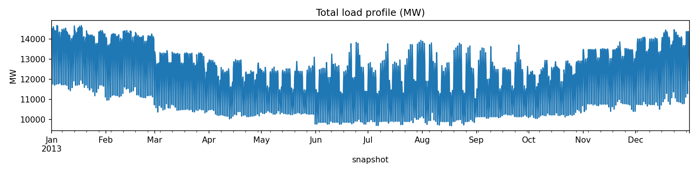
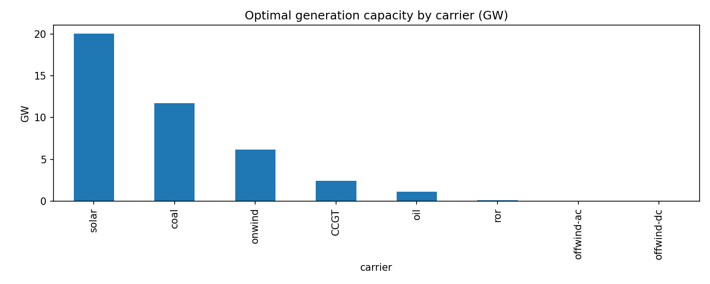
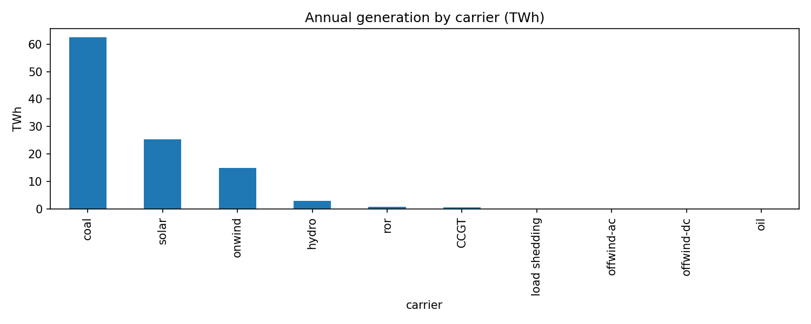

<!--
SPDX-FileCopyrightText:  PyPSA-Earth and PyPSA-Eur Authors

SPDX-License-Identifier: CC-BY-4.0
-->

# Part 2: Analyse Results

!!! note
    This tutorial assumes you have completed [Part 1](1-baseline-model.md) and have a solved network file at
    `results/KZ/networks/elec_s_10_ec_lcopt_6h.nc`.

## Introduction

The optimiser has finished — now comes the interesting part. In this tutorial we open the solved network, get a feel for what is inside it, and ask the questions any energy modeller cares about: how much power is being produced, by whom, and does it match reality? By the end you will have a set of key performance indicators for the Kazakhstan **power system** and a first sanity check against published statistics.

This use-case series deliberately stays in the **electricity workflow** (`solve_all_networks`) — not the sector-coupled model (`solve_sector_networks`). Over the following parts we will calibrate and validate that power model against **2020** data before exploring further scenarios.

All of the work here is done in a Jupyter notebook. No Snakemake, no configuration files — just Python and a solved `.nc` file.

---

## Locating your results

After a successful run the solved network lands at:

```
results/KZ/networks/elec_s_10_ec_lcopt_6h.nc
```

This single NetCDF file is the heart of everything. It contains the full network topology, all generator and line parameters, the optimised capacities, and 1460 snapshots of dispatch data. Think of it as a self-contained database of your model run.

If this file is not there, return to [Part 1](1-baseline-model.md) or check the [FAQ](../../community/faq.md) for download and workflow issues.

---

## Create a notebook

All paths in this tutorial — `results/KZ/networks/...` — are relative to the **PyPSA-Earth project root** (the folder that contains `Snakefile` and your `config.KZ.yaml`).

From there, start JupyterLab:

```bash
cd /path/to/pypsa-earth
jupyter lab
```

In the browser, create a **new notebook** and save it as `analyze_kz.ipynb` in the project root — not under `doc/`. The cells below are what you add step by step as you read on.

If you use VS Code or Cursor instead, open the command palette (`Ctrl+Shift+P`), run **Create: New Jupyter Notebook**, and save it as `analyze_kz.ipynb` in the project root. Select the `pypsa-earth` conda environment as the kernel.

---

## Opening the solved network

Load the network and print a summary. This is always the first thing to do — it tells you immediately whether the file loaded cleanly and gives you a count of every component type.

```python
import pypsa
import pandas as pd
import matplotlib.pyplot as plt

n = pypsa.Network("results/KZ/networks/elec_s_10_ec_lcopt_6h.nc")
print(n)
```

You should see something like:

```
PyPSA Network
Components:
 - Bus: 30
 - Carrier: 23
 - Generator: 65
 - Line: 10
 - Link: 40
 - Load: 10
 - StorageUnit: 2
 - Store: 20
Snapshots: 1460
```

The 1460 snapshots correspond to one full year at 6-hourly resolution (8760 h ÷ 6 = 1460).

---

## Network components at a glance

Before diving into numbers it helps to know what you are looking at. A PyPSA `Network` organises everything into typed component tables. Each component has a static DataFrame (e.g. `n.generators` with one row per generator) and, where things change over time, a matching time-varying DataFrame (e.g. `n.generators_t.p` with one column per generator and one row per snapshot).

| Component | Attribute | Description |
|---|---|---|
| `Bus` | `n.buses` | Electrical nodes — one per cluster in our 10-node model |
| `Line` | `n.lines` | AC transmission lines between buses |
| `Generator` | `n.generators` | Power plants: coal, gas, wind, solar, run-of-river (ror) |
| `Load` | `n.loads` | Electricity demand at each bus |
| `StorageUnit` | `n.storage_units` | Technologies with a coupled power/energy ratio (PHS) |
| `Store` | `n.stores` | Energy storage (batteries, H₂) — capacity in MWh; charging and discharging via `Link`s |
| `Link` | `n.links` | Multi-port converters: battery chargers, electrolysers, etc. |

For a thorough description of every attribute and convention, the [PyPSA component reference](https://docs.pypsa.org/en/latest/user-guide/components/buses/) is the definitive resource.

---

## Electricity demand

Let's start with demand — it sets the scale for everything else. The load profile is PyPSA-Earth's estimate of Kazakhstan's hourly electricity consumption, disaggregated spatially across the 10 nodes.

### Total annual demand

```python
# snapshot_weightings tells us how many hours each snapshot represents.
# At 6h resolution every snapshot counts as 6 hours.
weights = n.snapshot_weightings.generators

total_demand_TWh = n.loads_t.p_set.multiply(weights, axis=0).sum().sum() / 1e6
print(f"Total annual demand: {total_demand_TWh:.1f} TWh")
```

For Kazakhstan the number should come out around **106–107 TWh**:

```
Total annual demand: 106.8 TWh
```

Good — that is a plausible number for Kazakhstan. Keep it in mind as we look at the rest of the results.

### Demand profile

Plotting the full-year profile is a quick sanity check. You should see a clear seasonal pattern — demand peaks in the cold Central Asian winter and dips in summer — with a daily cycle visible when you zoom in.

```python
fig, ax = plt.subplots(figsize=(12, 3))
n.loads_t.p_set.sum(axis=1).plot(ax=ax, title="Total load profile (MW)")
ax.set_ylabel("MW")
fig.tight_layout()
```



---

## Installed capacities

Now let's look at what the model built. The `statistics()` method is the most convenient entry point — it sweeps across all component types and returns a tidy MultiIndex DataFrame.

```python
caps = n.statistics()["Installed Capacity"].dropna() / 1e3  # GW
print(caps.sort_values(ascending=False).to_string())
```

For our Kazakhstan run the output looks like this:

```
Line         AC                    31.2 GW
Generator    Load shedding         17.6 GW
             Coal                  11.7 GW
             Combined-Cycle Gas     2.4 GW
StorageUnit  Reservoir & Dam        2.3 GW
Generator    Onshore Wind           1.4 GW
             Solar                  1.2 GW
             Oil                    1.1 GW
             Run of River           0.1 GW
```

A few things worth noticing. **Coal (11.7 GW), gas (2.4 GW), and hydro (2.3 GW) reflect the existing fleet** from the powerplantmatching database — their `Installed Capacity` equals `Optimal Capacity` because the optimiser did not add conventional build.

**Load shedding (17.6 GW)** appears at the top — but this is expected. Load shedding in PyPSA is a soft-constraint generator added automatically to every bus at a very high cost (100 €/kWh by default). Its `p_nom` is set to roughly match peak demand at that bus, so the total across 10 nodes lands around 17 GW — comparable to Kazakhstan's peak load. Its purpose is purely numerical: it prevents the model from becoming infeasible if supply briefly falls short. In a well-calibrated model it dispatches little or nothing. It is possible to disable it via `solving.options.load_shedding: false`, which we will consider in the later parts of this series once the model is properly calibrated.

### Installed capacity vs. optimal capacity

The `statistics()` method exposes several capacity columns that are easy to confuse:

- **`Installed Capacity`** — maps to `p_nom`, the *pre-existing* capacity from the powerplant database. For existing coal or hydro plants this is the real-world installed capacity. For extendable technologies (wind, solar, new gas) that the model is allowed to build, `p_nom` is typically zero.
- **`Optimal Capacity`** — maps to `p_nom_opt`, the capacity *after* the optimiser has run. For fixed existing plants it equals `Installed Capacity`. For extendable technologies it is whatever the optimiser decided to build.

To see how much *new* capacity was added on top of the existing fleet:

```python
stat = n.statistics()[["Installed Capacity", "Optimal Capacity"]].dropna() / 1e3  # GW
stat["New build"] = stat["Optimal Capacity"] - stat["Installed Capacity"]
print(stat.sort_values("Optimal Capacity", ascending=False).to_string())
```

For coal and hydro the `New build` column should be ~0 — those are fixed existing plants. For onshore wind and solar you will see positive values — that is new renewable capacity the optimiser chose to add.

For our Kazakhstan run the output looks like this (abbreviated):

```
                          Installed Capacity  Optimal Capacity  New build
Store       H2                          0.0             39.9       39.9
Generator   Solar                       1.2             20.1       18.9
            Load shedding              17.6             17.6        0.0
            Coal                       11.7             11.7        0.0
Store       Battery Storage             0.0              8.4        8.4
Generator   Onshore Wind                1.4              6.2        4.8
            Combined-Cycle Gas          2.4              2.4        0.0
StorageUnit Reservoir & Dam             2.3              2.3        0.0
            Oil                         1.1              1.1        0.0
```

A few things stand out immediately:

- **Coal, gas, hydro, oil: zero new build.** The optimiser accepted the existing fleet as-is — their capacity is fixed at the values from the powerplantmatching database.
- **Solar: +18.9 GW, onshore wind: +4.8 GW.** By default, PyPSA-Earth treats wind and solar as *extendable*: the optimiser is allowed to add capacity on top of what is already installed.
- **H2 and battery storage: large new build.** Storage is extendable by default too, so the model pairs the renewable build with storage to manage intermittency.

This is the default baseline from Part 1 — we have not changed any settings yet.

For a cleaner per-carrier view of generators only, drop the shedding component and plot:

```python
gen_caps = (
    n.generators.loc[n.generators.carrier != "load shedding"]  # exclude load shedding
    .groupby("carrier")["p_nom_opt"]
    .sum()
    .sort_values(ascending=False)
    / 1e3  # GW
)
print(gen_caps.to_string())
fig, ax = plt.subplots(figsize=(10, 4))
gen_caps.plot.bar(ax=ax, title="Optimal generation capacity by carrier (GW)")
ax.set_ylabel("GW")
fig.tight_layout()
```

For our Kazakhstan run we get:

```
carrier
solar         20.1 GW
coal          11.7 GW
onwind         6.2 GW
CCGT           2.4 GW
oil            1.1 GW
ror            0.1 GW
offwind-ac     0.0 GW
offwind-dc     0.0 GW
```

Note that this uses `p_nom_opt` — optimal capacity after expansion — so solar and onwind reflect the new build from the table above, not just what was in the powerplant database.



---

## Generation dispatch

Capacities tell you what *could* run — dispatch tells you what *did* run.

### Annual generation by carrier

The key calculation is: multiply each component's dispatch time series by the snapshot weights, sum over the year, then group by carrier.

PyPSA-Earth splits hydro across two component types: **run-of-river** plants are `Generator`s with carrier `ror`, while **reservoir and dam** plants are `StorageUnit`s with carrier `hydro`. A generation tally that only reads `n.generators_t.p` will miss the latter.

```python
gen_mwh = (
    n.generators_t.p.multiply(weights, axis=0).sum().groupby(n.generators.carrier).sum()
)

su_mwh = (
    n.storage_units_t.p.multiply(weights, axis=0)
    .sum()
    .groupby(n.storage_units.carrier)
    .sum()
)

gen = ((gen_mwh.add(su_mwh, fill_value=0)) / 1e6).sort_values(ascending=False)  # TWh
print(gen.to_string())
fig, ax = plt.subplots(figsize=(10, 4))
gen.plot.bar(ax=ax, title="Annual generation by carrier (TWh)")
ax.set_ylabel("TWh")
fig.tight_layout()
```

For our Kazakhstan run:

```
carrier
coal             62.5 TWh
solar            25.4 TWh
onwind           14.8 TWh
hydro             2.8 TWh
ror               0.8 TWh
CCGT              0.6 TWh
load shedding     0.0 TWh
offwind-ac        0.0 TWh
offwind-dc        0.0 TWh
oil               0.0 TWh
```

Together, `ror` and `hydro` supply about **3.6 TWh**.



You can cross-check this with `n.statistics()["Supply"]`, which computes the same thing internally — note that it lists reservoir hydro under `StorageUnit` rather than grouping it with generators:

```python
supply = n.statistics()["Supply"].dropna() / 1e6  # TWh
print(supply.sort_values(ascending=False).to_string())
```

The generator totals should match; reservoir hydro appears separately as `StorageUnit / Reservoir & Dam`. The manual approach above merges both into one table; `statistics()` covers all component types in one call but keeps the PyPSA component split visible.

### Capacity factors

Capacity factors tell you how hard each technology worked relative to its installed capacity. They are a useful cross-check: if a number looks wrong, it often points to a miscalibrated capacity or a missing constraint. As with generation, include storage units so reservoir hydro is not missed.

```python
gen_cf = (
    n.generators_t.p.divide(n.generators.p_nom_opt.clip(lower=1), axis=1)
    .mean()
    .groupby(n.generators.carrier)
    .mean()
)

su_cf = (
    n.storage_units_t.p.divide(n.storage_units.p_nom_opt.clip(lower=1), axis=1)
    .mean()
    .groupby(n.storage_units.carrier)
    .mean()
)

cf = gen_cf.add(su_cf, fill_value=0).sort_values(ascending=False)
print(cf.to_string())
```

For our Kazakhstan run:

```
carrier
ror              0.704262
coal             0.246406
onwind           0.240277
hydro            0.135637
solar            0.096808
CCGT             0.025536
load shedding    0.000000
offwind-ac       0.000000
offwind-dc       0.000000
oil              0.000000
```

Capacity factors are available here for a quick check.

---

## Model validation for 2020

So far we have been exploring the baseline without deciding what year we are modelling. For a first validation, **let's use 2020** as our reference year — recent enough for good statistics, and reported by several independent sources.

Useful references:

- **[IEA – Kazakhstan](https://www.iea.org/countries/kazakhstan)** — generation mix, energy balances
- **[EIA – International data](https://www.eia.gov/international/data/country/KAZ)** — production and consumption
- **[IRENA – IRENASTAT](https://pxweb.irena.org/pxweb/en/IRENASTAT/IRENASTAT__Power%20Capacity%20and%20Generation/)** — installed capacity and generation by technology (MW / GWh)
- **[Ember – Data Explorer](https://ember-climate.org/data/data-explorer/)** — generation and capacity by technology
- **[KEGOC](https://ar2020.kegoc.kz/eng/index.html)** — official Kazakh national electricity balance report

The tables below collect 2020 values from these sources.

### Electricity demand (2020)

| | EIA | Ember | KEGOC | Model (baseline) |
|---|---|---|---|---|
| Annual demand (TWh) | 103.4 | 107.9 | 107.3 | 106.8 |

### Installed capacity (2020, GW)

| | IRENA | EIA | Ember | KEGOC | Model (baseline) |
|---|---|---|---|---|---|
| Total | 23.65 | 24.84 | 21.65 | 23.62 | 42.86 |
| Coal | 19.46 | 20.65 | 13.4 | 13.4 | 11.72 |
| Gas | — | — | 4.06 | 6.01 | 2.43 |
| Hydro | 2.78 | 2.78 | 2.78 | 2.95 | 2.46 |
| Solar | 0.91 | 0.91 | 0.91 | 0.96 | 20.06 |
| Wind | 0.49 | 0.49 | 0.49 | 0.51 | 6.19 |
| Bioenergy | 0.01 | 0.01 | 0.01 | 0.001 | — |

For **IRENA** and **EIA**, the **Coal** row lists all fossil-fuel capacity — neither source splits coal and gas.

**KEGOC** uses a different breakdown: gas and fuel oil in **thermal power plants** are reported as one category, while **gas turbines** are listed separately. The **Gas** values in both tables sum thermal-plant gas/oil and gas turbines so they can be compared with IEA, Ember, and the model. There is no separate **Oil** row for KEGOC in the generation table — that fuel is included in **Gas**.

The **Model** column uses **optimal capacity** (`p_nom_opt`) from the baseline run, where wind and solar are **extendable by default** — so solar and wind values reflect new build, not the 2020 installed fleet. In later parts of this series we will make renewables non-extendable and re-run for a proper validation comparison.

### Electricity generation (2020, GWh)

| | IEA | EIA | Ember | IRENA | KEGOC | Model (baseline) |
|---|---|---|---|---|---|---|
| Total | 110,887 | 110,919 | 108,640 | 96,677 | 108,086 | 106,986 |
| Coal | 74,611 | 74,611 | 73,550 | 60,477 | 74,498 | 62,542 |
| Natural gas | 24,033 | 24,033 | 22,510 | 24,018 | 21,693 | 629 |
| Hydropower | 9,660 | 9,660 | 9,660 | 9,660 | 9,546 | 3,608 |
| Solar PV | 1,490 | 1,490 | 1,240 | 1,350 | 1,252 | 25,397 |
| Wind | 1,028 | 1,029 | 1,030 | 1,076 | 1,093 | 14,810 |
| Oil | 58 | 59 | 640 | 59 | — | 0 |
| Biofuels | 7 | 37 | 10 | 35 | 5 | — |


Model **gas** maps to `CCGT` generators; **hydro** combines run-of-river (`ror`) and reservoir (`hydro` storage units).

### What the comparison shows

**The baseline does not reproduce 2020.** That is expected — we have not calibrated anything yet:

- **Demand** has not been tuned to 2020 — the total may look plausible, but the profile and scaling are still defaults.
- **Installed capacities** diverge strongly — especially solar and wind, where the optimiser built far beyond what existed in 2020.
- **Generation by carrier** diverges accordingly — the dispatch reflects that uncorrected fleet, not Kazakhstan's 2020 mix.

This first comparison is not a failure — it tells us *where* the defaults stand relative to history and *what* to fix. The next tutorials calibrate the model step by step, starting with demand in **[Part 3](3-demand-data.md)**.

---

## Recap

You now have a working analysis pipeline for any PyPSA-Earth network and a first validation check against 2020 statistics. The pattern is always the same: open the `.nc` file, weight time series by `snapshot_weightings`, group by carrier, and compare against a reference.

| What you wanted | How you got it |
|---|---|
| Total annual demand | `n.loads_t.p_set` × `n.snapshot_weightings` |
| Installed vs. optimal capacity | `n.statistics()[["Installed Capacity", "Optimal Capacity"]]` |
| Generation by carrier | `n.generators_t.p` and `n.storage_units_t.p` × weights, grouped by `carrier` |
| Same thing, one call | `n.statistics()["Supply"]` |
| Capacity factors | `n.statistics()["Capacity Factor"]` or manual dispatch ÷ `p_nom_opt` |
| System cost | `n.objective` (EUR) |
| Everything at once | `n.statistics()` |

In **[Part 3](3-demand-data.md)** we go under the hood of the demand module — where the load profiles come from, how the demand multiplier works, and how to calibrate the model to match Kazakhstan's **2020** electricity consumption.
