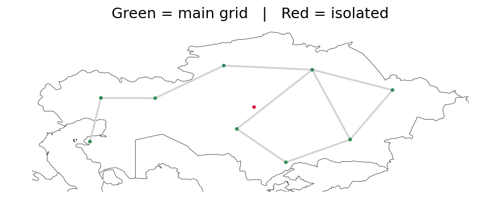
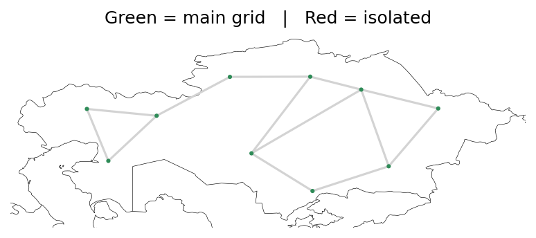

<!--
SPDX-FileCopyrightText:  PyPSA-Earth and PyPSA-Eur Authors

SPDX-License-Identifier: CC-BY-4.0
-->

# Part 5: Fix Isolated Nodes and Load Shedding

!!! note
    This tutorial assumes you have completed [Part 1](1-baseline-model.md) through [Part 4](4-generation-data.md). Your `config.KZ.yaml` should include the Part 3 demand settings and the Part 4 generation fleet, and you should have a solved network at `results/KZ/networks/elec_s_10_ec_lcopt_6h.nc`.

## Introduction

By the end of [Part 4](4-generation-data.md) the fleet matched KEGOC's 2020 capacities, yet the model still **shed about 7.7 TWh of load** — roughly 7–8% of Kazakhstan's annual demand. Load shedding means the optimiser could not serve demand at some buses in some hours, so it "dropped" that load at a very high penalty price. A validated fleet that still sheds load is a signal that the problem is **not generation** but the **network** the generation sits on.

In this tutorial we diagnose the cause — one or more **electrically isolated sub-networks** — and fix it by changing **how simplification handles islands**. This is the fastest lever: it re-runs in minutes and does not touch the OSM base network.

Everything in this part lives under **`cluster_options.simplify_network`** in the config and the **`simplify_network`** rule. It does not change the demand or the fleet.

---

## Where isolation comes from

PyPSA-Earth builds the transmission grid from **[OpenStreetMap (OSM)](https://www.openstreetmap.org/)** — volunteer-mapped substations and power lines, downloaded in [Part 1](1-baseline-model.md). The model topology is whatever OSM contains at download time, not an official KEGOC schematic.

Two facts about the workflow combine to create the problem:

```
build_demand_profiles  →  splits national demand across every substation bus
        ↓                  (weighted by population and GDP — no grid check)
simplify_network       →  merges/clusters buses, then handles leftover islands
        ↓
… cluster, prepare, solve …
```

1. **`build_demand_profiles`** takes the national annual total and distributes it across **all** substation buses using population and GDP weights. It does **not** check whether a bus is electrically connected to the rest of the grid.
2. If the OSM-derived network has a **gap** — a region whose lines never link to the national backbone — that region becomes its own **sub-network** (an electrical island). It still carries its share of demand, but the only generation available to serve it is whatever sits inside the island.

When an island's local generation cannot cover its local demand, the optimiser has no way to import power across the missing lines, so it **sheds** the unmet load. Nationally the capacity and demand totals look fine, but a some part of the country is starved.

!!! note "A PyPSA sub-network"
    After `n.determine_network_topology()`, every bus is labelled with a `sub_network`. Buses in the same `sub_network` are electrically connected; buses in different sub-networks cannot exchange power. A healthy country model has **one** dominant AC sub-network (the "backbone") carrying almost all load.

---

## Step 1: See the island on a map

Open your Part 2 notebook (`analyze_kz.ipynb`) and reload the solved network. First, colour buses by whether they belong to the main grid or to an island:

```python
import pypsa
import matplotlib.pyplot as plt

n = pypsa.Network("results/KZ/networks/elec_s_10_ec_lcopt_6h.nc")
n.determine_network_topology()

# The backbone is the sub-network carrying the most load
load_by_sub = n.loads_t.p_set.mean().groupby(n.buses.sub_network).sum()
backbone = load_by_sub.idxmax()

is_isolated = n.buses.sub_network != backbone
bus_colors = is_isolated.map({True: "crimson", False: "seagreen"})

# Map extent: [lon_min, lon_max, lat_min, lat_max] — frame Kazakhstan
boundaries = [46, 88, 40, 56]

n.plot(
    bus_colors=bus_colors,
    bus_sizes=0.03,
    line_colors="lightgray",
    boundaries=boundaries,
    title="Green = main grid   |   Red = isolated",
)
plt.show()
```

Any **red** bus is electrically isolated from the green backbone — load there cannot import power from the rest of the grid. You may see **one red bus** rather than a whole western region; Step 3 explains why. After the fix in Step 4, re-plot — you should see no red buses.



*Green = main grid; red = isolated bus. Example from the Part 4 solved network with default simplification settings.*

---

## Step 2: Confirm load shedding on the island

The map shows *where* the problem is. Confirm that the **~7.7 TWh load shedding** from Part 4 sits on the **red** sub-network, not on the green backbone.

Load-shedding generators are named `<bus> load`:

```python
weights = n.snapshot_weightings.generators
shed = n.generators_t.p.filter(like="load").multiply(weights, axis=0).sum() / 1e6  # TWh
shed_by_sub = shed.groupby(
    n.generators.loc[shed.index, "bus"].map(n.buses.sub_network)
).sum()
print(shed_by_sub[shed_by_sub > 0].round(2))
```

Expected output — shedding on the **isolated** sub-network only (the backbone should not appear):

```
1    7.67
dtype: float64
```

The index is the **`sub_network`** id from Step 1 (the red bus). **~7.7 TWh** here matches Part 4's **~7.7 TWh** total load shedding: almost all unmet load sits on that one island, not on the green backbone.

---

## Step 3: The three isolation thresholds

Simplification has three settings for isolated sub-networks under **`cluster_options.simplify_network`**:

| Parameter | Unit | What it does |
|---|---|---|
| `p_threshold_drop_isolated` | **MW** (mean load) | **Deletes** islands whose total mean load is below the threshold. The load *disappears* from the model. |
| `p_threshold_merge_isolated` | **MW** (mean load) | Collapses small islands into **one isolated bus per country** — still disconnected from the backbone. |
| `s_threshold_fetch_isolated` | **share** of country load | Attaches islands whose share is below the threshold to the **nearest backbone bus**, creating a real electrical connection. |

The critical distinction:

- **`drop`** removes load (avoids shedding by throwing demand away).
- **`merge`** is the **default trap** (`p_threshold_merge_isolated: 300` in `config.default.yaml`): it collapses many small islands into **one isolated bus per country**. That bus still cannot import power, so it **still sheds** — and it can hold a **large** share of national load (e.g. ~7%).
- **`fetch`** is the **actual fix**: it wires stranded load onto the closest **connected** bus so the backbone's generation can serve it.

**Defaults in `config.default.yaml`:** merge is **on** (`300` MW) and fetch is **off** (`false`). Nothing reconnects stranded islands — which is why load shedding persists after Part 4.

!!! note "This is a modelling simplification, not a real line"
    `fetch` does **not** build a physical line. It re-assigns the stranded load (and any generation) to the geographically nearest connected bus so the linear program can balance it. The load is served, but its electrical location is approximated — a modelling shortcut, not a real grid connection.

---

## Step 4: Settings for Kazakhstan

**1. `p_threshold_merge_isolated: false` — stop stacking islands.**

The default merges islands below **300 MW** mean load onto one stranded bus per country. For KZ that stacks much of the western pocket into a single ~7% island that still cannot import power:

```yaml
p_threshold_merge_isolated: false
```

**2. `s_threshold_fetch_isolated: 0.05` — turn fetch on.**

Fetch is **`false` by default** — it does nothing until you set a share threshold. **`0.05`** reconnects any island below **5%** of national load to the nearest backbone bus. With merge off, the western fragments in KZ are each below 5%:

```yaml
s_threshold_fetch_isolated: 0.05
```

**3. `p_threshold_drop_isolated: false` — do not delete islands.**

`drop` runs **before** `fetch` and removes buses by **mean load on the sub-network**, not by generation. In KZ, large hydro plants (e.g. East Kazakhstan — Bukhtarma, Ust-Kamenogorsk, Shulbinskaya) can sit on OSM islands with **little assigned demand**. With a MW threshold (the default is **20**), those buses — and all attached power plants — are deleted before `fetch` can reconnect them.

```yaml
p_threshold_drop_isolated: false
```

Keep drop off for KZ. Use `fetch` to reconnect stranded **load**; do not throw away stranded **generation**.

## Step 5: Add the settings to `config.KZ.yaml`

Add a `cluster_options` block:

```yaml
cluster_options:
  simplify_network:
    p_threshold_merge_isolated: false # do not stack islands on one stranded bus
    s_threshold_fetch_isolated: 0.05  # fetch is off by default; reconnect islands < 5% of national load
    p_threshold_drop_isolated: false  # do not delete low-load islands (can remove hydro)
```

You can [download the file](snippets/config.KZ.topology.yaml){: download="config.KZ.yaml"} and merge it with your existing `config.KZ.yaml`, or add the `cluster_options` block by hand.

---

## Step 6: Re-run the workflow

Run the same target as before:

```bash
snakemake --cores 4 solve_all_networks --configfile config.KZ.yaml
```

**Expected runtime:** a few minutes — much faster than Part 1. OSM data, cutouts, demand profiles, and the powerplant list stay cached from earlier parts.

---

## Step 7: Verify the fix

Reload the solved network and check **total** load shedding (Step 2 only breaks it down by island — here you want the national total near zero) and **annual demand** (same as [Part 2](2-analyze-results.md#total-annual-demand)):

```python
weights = n.snapshot_weightings.generators
total_TWh = n.loads_t.p_set.multiply(weights, axis=0).sum().sum() / 1e6
shed_TWh = (
    n.generators_t.p.filter(like="load").multiply(weights, axis=0).sum().sum() / 1e6
)
print(f"Total annual demand: {total_TWh:.2f} TWh")
print(f"Load shedding: {shed_TWh:.2f} TWh")  # expect ~0
```

Example after the Part 5 fix (with **`scale: 1.005`** from Part 3 still in place):

```
Total annual demand: 108.54 TWh
Load shedding: 0.00 TWh
```

**Load shedding at 0** confirms the island fix. **Demand above KEGOC 107.3 TWh** is expected: `fetch` puts regional load back on the main grid (Part 3's `scale` was tuned when that load was missing), and **`scale: 1.005`** still sits on top of the native GEGIS total (~108 TWh). Do **not** change **`scale`** here — [Part 6](6-transmission-network.md#step-8-final-calibration-of-scale) recalibrates once the transmission grid is settled.

Optionally, re-run the **installed capacity** check from [Part 2](2-analyze-results.md#installed-capacities) (same `n.statistics()` call). Compare **ror** and **hydro** against the KEGOC 2020 table — they should stay aligned with the Part 4 fleet. This is a useful sanity check because `p_threshold_drop_isolated` can delete **low-load islands** before `fetch` runs, and that may remove **large hydro plants** that happen to sit on those islands.



*All green — no isolated buses after `fetch`.*

---

## Recap

| Step | Config key | Value | Role |
|---|---|---|---|
| 4 | `cluster_options.simplify_network.p_threshold_merge_isolated` | `false` | Do not collapse islands onto one stranded bus (default 300 MW) |
| 4 | `cluster_options.simplify_network.s_threshold_fetch_isolated` | `0.05` | Attach islands below 5% of national load to the nearest backbone bus |
| 4 | `cluster_options.simplify_network.p_threshold_drop_isolated` | `false` | Do not delete low-load islands (preserves hydro and other plants on OSM artefacts) |

Load shedding caused by electrical islands is resolved: the stranded demand is now wired onto the main grid and served by national generation. **`p_threshold_drop_isolated: false`** also keeps power plants on low-load islands in the model, so **installed capacity** — in particular hydro — stays aligned with the Part 4 fleet instead of being deleted during simplification. This is a **simplification-level** fix — fast and effective, but it approximates *where* that load connects.

In **[Part 6](6-transmission-network.md)** we improve how the base transmission network is built from OSM — KZ voltage levels and line ratings — and do a **final** `scale` check once the grid is settled. Part 5 settings remain useful for any islands OSM still misses.
