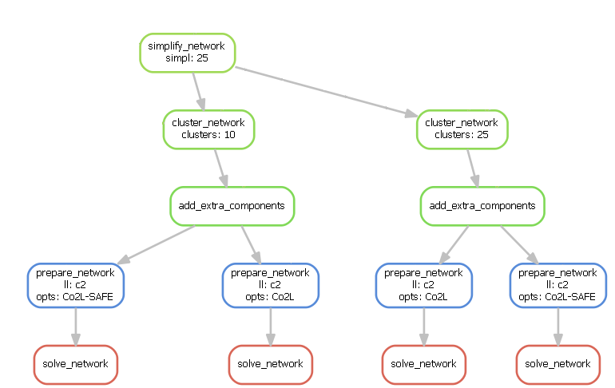

<!--
SPDX-FileCopyrightText:  PyPSA-Earth and PyPSA-Eur Authors

SPDX-License-Identifier: CC-BY-4.0
-->

# Configuration

PyPSA-Earth imports the configuration options originally developed in [PyPSA-Eur](https://pypsa-eur.readthedocs.io/en/latest/index.html) and here reported and adapted.
The options here described are collected in a `config.yaml` file located in the root directory.
Users should copy the provided default configuration (`config.default.yaml`) and amend
their own modifications and assumptions in the user-specific configuration file (`config.yaml`]);
confer installation instructions at [installation](../home/installation.md).

  Credits to PyPSA-Eur developers for the initial drafting of the configuration documentation here reported

# Top-level configuration

```yaml
--8<-- "configtables/snippets/toplevel.yaml"
```

{{ read_csv('configtables/toplevel.csv') }}

# run

It is common conduct to analyse energy system optimisation models for **multiple scenarios** for a variety of reasons,
e.g. assessing their sensitivity towards changing the temporal and/or geographical resolution or investigating how
investment changes as more ambitious greenhouse-gas emission reduction targets are applied.

The `run` section is used for running and storing scenarios with different configurations which are not covered by [wildcards](wildcards.md). It determines the path at which resources, networks and results are stored. Therefore the user can run different configurations within the same directory. If a run with a non-empty name should use cutouts shared across runs, set `shared_cutouts` to `true`.

```yaml
--8<-- "configtables/snippets/run.yaml"
```

{{ read_csv('configtables/run.csv') }}

# scenario

The `scenario` section is an extraordinary section of the config file
that is strongly connected to the [wildcards](wildcards.md) and is designed to
facilitate running multiple scenarios through a single command

```bash
snakemake -j 1 solve_all_networks
```

For each wildcard, a **list of values** is provided. The rule `solve_all_networks` will trigger the rules for creating `results/networks/elec_s{simpl}_{clusters}_ec_l{ll}_{opts}.nc` for **all combinations** of the provided wildcard values as defined by Python's [itertools.product(...)](https://docs.python.org/2/library/itertools.html#itertools.product) function that snakemake's [expand(...) function](https://snakemake.readthedocs.io/en/stable/snakefiles/rules.html#targets) uses.

An exemplary dependency graph (starting from the simplification rules) then looks like this:



```yaml
--8<-- "configtables/snippets/scenario.yaml"
```

{{ read_csv('configtables/scenario.csv') }}

# snapshots

Specifies the temporal range for the historical weather data, which is used to build the energy system model. It uses arguments to [pandas.date_range](https://pandas.pydata.org/pandas-docs/stable/reference/api/pandas.date_range.html). The date range must be in the past (before 2022). A well-tested year is 2013.

```yaml
--8<-- "configtables/snippets/snapshots.yaml"
```

{{ read_csv('configtables/snapshots.csv') }}

# crs

Defines the coordinate reference systems (crs).

```yaml
--8<-- "configtables/snippets/crs.yaml"
```

{{ read_csv('configtables/crs.csv') }}

# augmented_line_connection

If enabled, it increases the connectivity of the network. It makes the network graph [k-edge-connected](https://en.wikipedia.org/wiki/K-edge-connected_graph), i.e.,
if fewer than k edges are removed, the network graph stays connected. It uses the [k-edge-augmentation](https://networkx.org/documentation/stable/reference/algorithms/generated/networkx.algorithms.connectivity.edge_augmentation.k_edge_augmentation.html#networkx.algorithms.connectivity.edge_augmentation.k_edge_augmentation)
algorithm from the [NetworkX](https://networkx.org/documentation/stable/index.html) Python package.

```yaml
--8<-- "configtables/snippets/augmented_line_connection.yaml"
```

{{ read_csv('configtables/augmented_line_connection.csv') }}

# cluster_options

Specifies the options to simplify and cluster the network. This is done in two stages, first using the rule `simplify_network` and then using the rule `cluster_network`. For more details on this process, see the [PyPSA-Earth paper](https://www.sciencedirect.com/science/article/pii/S0306261923004609), section 3.7.

```yaml
--8<-- "configtables/snippets/cluster_options.yaml"
```

{{ read_csv('configtables/cluster_options.csv') }}

# build_shape_options

Specifies the options to build the shapes in which the region of interest (`countries`) is divided.

```yaml
--8<-- "configtables/snippets/build_shape_options.yaml"
```

{{ read_csv('configtables/build_shape_options.csv') }}

# subregion

If enabled, this option allows a region of interest (`countries`) to be redefined into subregions,
which can be activated at various stages of the workflow. Currently, it is used in `simplify_network` and `cluster_network` rule.

```yaml
--8<-- "configtables/snippets/subregion.yaml"
```

{{ read_csv('configtables/subregion.csv') }}

The names of subregions are arbitrary. Its sizes are determined by how many GADM IDs that are included in the list.
A single country can be divided into multiple subregions, and a single subregion can include GADM IDs from multiple countries.
If the same GADM ID appears in different subregions, the first subregion listed will take precedence over that region.
The remaining GADM IDs that are not listed will be merged back to form the remaining parts of their respective countries.
For example, consider the Central District of Botswana, which has a GADM ID of `BW.3`. To separate this district from the rest of the country, you can select:

> **See `config.default.yaml` for the full configuration.**

There are several formats for GADM IDs depending on the version, so before using this feature, please review the `resources/shapes/gadm_shape.geojson` file which can be created using the command:

``bash
snakemake -j 1 build_shapes

``
   The rule `build_shapes` currently use [Version 4.1](https://geodata.ucdavis.edu/gadm/gadm4.1/gpkg/) for their GADM data. This may change in the future.

# clean_osm_data_options

Specifies the options to clean the [OpenStreetMap](https://wiki.osmfoundation.org/wiki/Main_Page) (OSM) data.

```yaml
--8<-- "configtables/snippets/clean_osm_data_options.yaml"
```

{{ read_csv('configtables/clean_osm_data_options.csv') }}

# build_osm_network

Specifies the options to build the [OpenStreetMap](https://wiki.osmfoundation.org/wiki/Main_Page) (OSM) network.

```yaml
--8<-- "configtables/snippets/build_osm_network.yaml"
```

{{ read_csv('configtables/build_osm_network.csv') }}

# base_network

Specifies the minimum voltage magnitude in the base network and the offshore substations.

```yaml
--8<-- "configtables/snippets/base_network.yaml"
```

{{ read_csv('configtables/base_network.csv') }}

# load_options

Specifies the options to estimate future electricity demand (load). Different years might be considered for weather and the socioeconomic pathway (GDP and population growth), to enhance modelling capabilities.

```yaml
--8<-- "configtables/snippets/load_options.yaml"
```

{{ read_csv('configtables/load_options.csv') }}

The snapshots date range (`snapshots\start` - `snapshots\end`) must be in the `weather_year`.

# co2_budget

If enabled, this option allows setting different CO₂ targets for each planning horizon year. Only supports foresights with planning horizon such as myopic.

```yaml
--8<-- "configtables/snippets/co2budget.yaml"
```

{{ read_csv('configtables/co2_budget.csv') }}

# electricity

Specifies the options for the rule `add_electricity`. This includes options across several features, including but not limited to: voltage levels, electricity carriers available, renewable capacity estimation, CO2 emission limits, operational reserve, storage parameters. See the table below for more details.

```yaml
--8<-- "configtables/snippets/electricity.yaml"
```

{{ read_csv('configtables/electricity.csv') }}

Carriers in `conventional_carriers` must not also be in `extendable_carriers`.

# lines

Specifies electricity line parameters.
   :start-after: PV:
{{ read_csv('configtables/lines.csv') }}

# links

Specifies Link parameters. Links are a fundamental component of [PyPSA](https://pypsa.readthedocs.io/en/latest/components.html) .   :end-before: transformers:

{{ read_csv('configtables/links.csv') }}

# transformers

Specifies transformers parameters and types.   :end-before: atlite:

{{ read_csv('configtables/transformers.csv') }}

# atlite

Define and specify the `atlite.Cutout` used for calculating renewable potentials and time-series. All options except for `features` are directly used as [cutout parameters](https://atlite.readthedocs.io/en/latest/ref_api.html#cutout).   :end-before: renewable:

{{ read_csv('configtables/atlite.csv') }}

# renewable

Specifies the options to obtain renewable potentials in every cutout. These are divided in five different renewable technologies: onshore wind (`onwind`), offshore wind with AC connection (`offwind-ac`), offshore wind with DC connection (`offwind-dc`), solar (`solar`), and hydropower (`hydro`).

## onwind   :end-before:   offwind-ac

{{ read_csv('configtables/onwind.csv') }}

## offwind-ac   :end-before:   offwind-dc

{{ read_csv('configtables/offwind-ac.csv') }}

## offwind-dc   :end-before:   solar

{{ read_csv('configtables/offwind-dc.csv') }}

## solar   :end-before:   hydro

{{ read_csv('configtables/solar.csv') }}

## hydro

> **See `config.default.yaml` for the full configuration.**

{{ read_csv('configtables/hydro.csv') }}

## csp

> **See `config.default.yaml` for the full configuration.**

{{ read_csv('configtables/csp.csv') }}

# costs

Specifies the cost assumptions of the technologies considered. Cost information is obtained from the config file and the file `data/costs.csv`, which can also be modified manually.
   :start-after: Costs Configuration
{{ read_csv('configtables/costs.csv') }}

To change cost assumptions in more detail (i.e. other than `marginal_cost`), consider modifying cost assumptions directly in `data/costs.csv` as this is not yet supported through the config file.
   You can also build multiple different cost databases. Make a renamed copy of `data/costs.csv` (e.g. `data/costs-optimistic.csv`) and set the variable `COSTS=data/costs-optimistic.csv` in the `Snakefile`.

   The `marginal costs` or in this context `variable costs` of operating the assets is important for realistic operational model outputs.
   It can define the curtailment order of renewable generators, the dispatch order of generators, and the dispatch of storage units.
   If not approapriate set, the model might output unrealistic results. Learn more about this in
   [Parzen et al. 2023](https://www.sciencedirect.com/science/article/pii/S2589004222020028) and in
   [Kittel et al. 2022](https://www.sciencedirect.com/science/article/pii/S2589004222002723).

# monte_carlo

Specifies the options for Monte Carlo sampling.

{{ read_csv('configtables/monte-carlo.csv') }}

# solving

Specify linear power flow formulation and optimization solver settings.

## options

{{ read_csv('configtables/solving-options.csv') }}

## solver

{{ read_csv('configtables/solving-solver.csv') }}

# plotting

Specifies plotting options.
{{ read_csv('configtables/plotting.csv') }}
