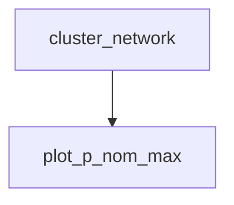
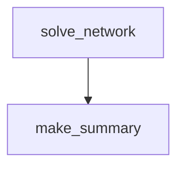
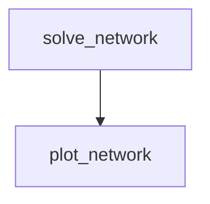

<!--
SPDX-FileCopyrightText:  PyPSA-Earth and PyPSA-Eur Authors

SPDX-License-Identifier: CC-BY-4.0
-->

# Plotting and Summary

## Rule `plot_p_nom_max`

## Rule `make_summary`

## Rule `plot_summary`

## Rule `plot_network`

